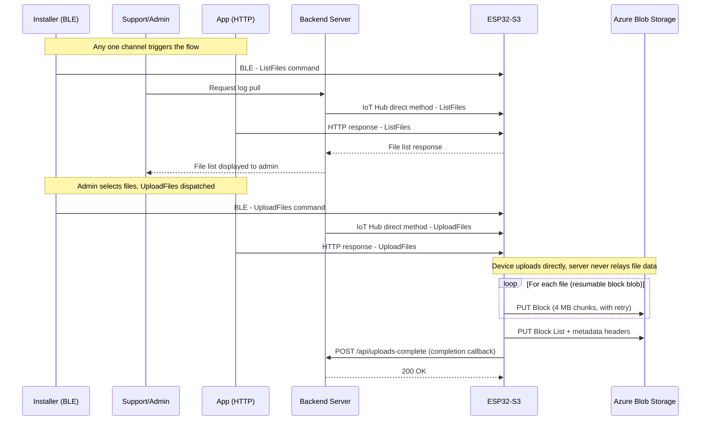

# IoT File Upload

| | |
|---|---|
| **Version** | 0.8 |
| **Status** | Draft |
| **Last updated** | 2026-06-19 |
| **Owner** | Jonathan, Haven Lighting |
| **Target / scope** | On-demand debug log upload, ESP32-S3 → Azure Blob Storage |
| **Classification** | Internal |

> Status values: `Draft` · `In Review` · `Approved` · `Deprecated`.
> Bump **Version** and add a **Revision History** row on every edit.

---

## 1. Overview
Enable a support engineer or admin to pull debug logs — Wi-Fi, Bluetooth, Ethernet performance logs — off a specific ESP32-S3 device on a home network, for manual case debugging. The Azure backend orchestrates the process securely, tolerates unreliable home connectivity via resumable uploads, guarantees unique file names with timestamps, and never overwrites existing files.

The device side is intentionally minimal: it supports exactly **two commands** (see §4). The backend handles all orchestration, authorization, and storage.

## 2. Goals & Non-Goals

**Goals**

- Command-driven, two-phase flow: list available files, then upload a chosen subset.
- One unique blob per file/session, with timestamps in the path.
- Resumable uploads for flaky home networks.
- Scale to thousands of devices.
- Metadata for retrieval and tracking.
- Security via short-lived SAS tokens; devices never hold account keys.
- Direct device-to-blob uploads to minimize server load.

**Non-Goals**

- File processing / transformation pipelines (handled downstream).
- Real-time telemetry streaming (separate spec).
- Cross-fleet log analytics (manual, per-device debugging is the v1 use case).

## 3. Triggers & Actors
The same command payload can reach the device through any of three channels, dispatched by different actors, all handled by one transport-agnostic command handler on the device:
- **Installer, on-site** → BLE from the mobile app.
- **Support/admin** → Azure IoT Hub direct method.
- **App** → HTTP response.

BLE is a **trigger only** — the device always uploads to Azure Blob Storage directly over its own Wi-Fi/Ethernet connection. The phone never relays log data. Per-channel authorization (different trust levels per actor) is deferred — see §9.

### 3.1 Flow Overview



## 4. Device Command Interface
The device implements exactly two commands. Both accept a JSON payload and are independent of the channel they arrive on. The two are asymmetric:
- **`ListFiles` is request/response** — its return payload (the list of available files) is essential.
- **`UploadFiles` is fire-and-forget during the transfer** — no per-file handshakes or acknowledgments. After the device receives it, the subsequent communication is just the HTTP file uploads to the Blob Storage URL, followed by a single **completion callback** (one HTTP POST) when the whole run finishes.

### 4.1 `ListFiles` — harvest available files
Device scans its filesystem (SPIFFS / LittleFS) and returns the set of files available for upload. This response is required.

Response (device → backend):
```json
{
  "deviceId": "dev-abc123",
  "files": [
    { "filename": "wifi-debug.log",     "path": "/logs/wifi-debug.log",     "size": 184320 },
    { "filename": "bt-debug.log",        "path": "/logs/bt-debug.log",       "size": 40960  },
    { "filename": "eth-perf.log",        "path": "/logs/eth-perf.log",       "size": 12288  }
  ]
}
```
The backend/app shows this list so the admin can select which files to pull.

### 4.2 `UploadFiles` — upload a selected array to Blob Storage (blind / fire-and-forget)
Command (backend → device): an array of file paths plus the target Blob Storage URL (a SAS-scoped base URL), and a `callbackUrl` for the completion POST. The command can be delivered as the payload of an HTTP response (or any channel). During the run the device sends no per-file acks — it just performs the HTTP uploads to Blob Storage. When the run finishes, it sends one completion callback (see §4.3).

Command payload:
```json
{
  "command": "UploadFiles",
  "deviceId": "dev-abc123",
  "blobBaseUrl": "https://account.blob.core.windows.net/container?<sasToken>",
  "pathPrefix": "logs/dev-abc123/2026/06/18/",
  "timestamp": "2026-06-18T13:45:22Z",
  "callbackUrl": "https://api.example.com/uploads/complete",
  "files": [
    { "path": "/logs/wifi-debug.log", "logType": "wifi" },
    { "path": "/logs/eth-perf.log",   "logType": "eth"  }
  ]
}
```
For each file the device composes the destination blob name (see §5) and uploads it as a block blob with retry/resume (see §6). No status is sent during the run; when all files are processed the device fires a single completion callback (§4.3). The backend can also independently confirm results by observing Blob Storage (see §7).

### 4.3 Completion callback (device → backend)
When the `UploadFiles` run finishes, the device sends one HTTP POST to `callbackUrl` summarizing the outcome. On success the payload is compact; on error it carries as much diagnostic detail as the device can provide.

Success:
```json
{
  "deviceId": "dev-abc123",
  "status": "ok",
  "blobBaseUrl": "https://account.blob.core.windows.net/container/logs/dev-abc123/2026/06/18/",
  "completedAt": "2026-06-18T13:47:10Z",
  "filesRequested": 2,
  "filesUploaded": 2
}
```

Error (as detailed as possible):
```json
{
  "deviceId": "dev-abc123",
  "status": "error",
  "blobBaseUrl": "https://account.blob.core.windows.net/container/logs/dev-abc123/2026/06/18/",
  "completedAt": "2026-06-18T13:47:10Z",
  "filesRequested": 2,
  "filesUploaded": 1,
  "firmwareVersion": "1.4.2",
  "freeHeap": 184320,
  "network": { "type": "wifi", "rssi": -78 },
  "files": [
    {
      "path": "/logs/wifi-debug.log",
      "blobName": "2026-06-18T13-45-22-wifi-debug.log",
      "status": "ok",
      "size": 184320,
      "bytesUploaded": 184320,
      "blocksCommitted": 1,
      "durationMs": 5120
    },
    {
      "path": "/logs/eth-perf.log",
      "blobName": "2026-06-18T13-45-22-eth-debug.log",
      "status": "error",
      "size": 12288,
      "bytesUploaded": 4096,
      "blocksCommitted": 1,
      "attempts": 3,
      "errorStage": "put-block",
      "httpStatus": 403,
      "azureErrorCode": "AuthenticationFailed",
      "message": "SAS token expired before block 2 of 3 was committed",
      "lastAttemptAt": "2026-06-18T13:46:58Z"
    }
  ]
}
```

Field notes:
- `status` (top level): `"ok"` only if every requested file uploaded fully; otherwise `"error"`.
- `blobBaseUrl`: echoed back so the backend can correlate the callback with the session/blobs.
- Per-file `errorStage`: where it failed — e.g., `read-file`, `put-block`, `put-blocklist`, `dns`, `tls`, `connect`, `timeout`.
- `httpStatus` / `azureErrorCode`: the actual response from Blob Storage when available (e.g., `403`/`AuthenticationFailed`, `409`/`BlobAlreadyExists`), so the cause is unambiguous.
- Device context (`firmwareVersion`, `freeHeap`, `network`) is included on error to aid diagnosis without a second round-trip.
- The callback remains best-effort — it can be lost on a flaky network — so the backend still reconciles against Blob Storage (see §7).

## 5. Blob Naming & Organization (overwrite prevention)
```
logs/{deviceId}/{year}/{month}/{day}/{timestamp}-{logType}-debug.log
```
Example: `logs/dev-abc123/2026/06/18/2026-06-18T13-45-22-wifi-debug.log`

- Path prefixes act as virtual folders for browsing in Azure Portal / Storage Explorer.
- The `{timestamp}` and `{pathPrefix}` are supplied by the **server** in the `UploadFiles` command, so naming is server-controlled and consistent.
- Device ID + timestamp + log type guarantees uniqueness and prevents overwrites — sufficient for manual case debugging (no separate case ID needed).

## 6. Handling Unreliable Connections (Resumable Block Blob Upload)
A basic `Put Blob` is all-or-nothing. Use **block blobs** (`Put Block` + `Put Block List`) for resume support.

Implementation notes (Arduino / ESP-IDF with `esp_http_client` or similar):
- Block size: up to 4 MB (PSRAM + large flash on this hardware makes this comfortable).
- Generate unique, fixed-length, base64-encoded Block IDs (e.g., `block-0001` padded).
- Persist progress (committed block list + offset) in NVS / LittleFS for restart/resume.

```cpp
// Pseudocode / key flow for one file in the UploadFiles array
const size_t BLOCK_SIZE = 4 * 1024 * 1024;
String blobUrl = blobBaseUrl_with_path;  // base + pathPrefix + composed blob name

std::vector<String> committedBlocks;
for (size_t offset = 0; offset < fileSize; offset += BLOCK_SIZE) {
    size_t chunkSize = min(BLOCK_SIZE, fileSize - offset);
    String blockId = base64Encode(padded(offset / BLOCK_SIZE));

    if (alreadyUploaded(blockId)) continue;  // resume: skip committed blocks

    int retries = 0;
    while (retries < 3) {
        if (uploadBlock(blobUrl + "&comp=block&blockid=" + blockId, fileChunk, chunkSize)) {
            committedBlocks.push_back(blockId);
            saveProgress();
            break;
        }
        retries++;
        delay(exponentialBackoff(retries));  // 1s, 2s, 4s
    }
}

// Commit: assemble blocks and set metadata
String blockListXml = buildBlockListXml(committedBlocks);
httpPut(blobUrl + "&comp=blocklist", blockListXml, headersWithMetadata);
```

### Metadata Headers (sent on Put Block List)
- `x-ms-meta-deviceid: dev-abc123`
- `x-ms-meta-devicename: LivingRoomSensor`
- `x-ms-meta-logtype: wifi`
- `x-ms-meta-uploadtime: 2026-06-18T13:45:22Z`
- `x-ms-version: 2024-11-04` (or latest supported)
- `x-ms-tags: ...` — optional blob index tags; lower priority since v1 is per-device retrieval, not cross-fleet querying.

### Resume Logic
- On reboot/retry, query committed vs. uncommitted blocks (`GET ...?comp=blocklist&blocklisttype=all`) and re-upload only what's missing.
- Exponential backoff + max retries per block.
- Azure IoT Hub's native file-upload feature is a managed alternative (handles SAS + completion notifications).

## 7. Server-Side Responsibilities (Azure Functions / App Service / IoT Hub)
- Dispatch `ListFiles`, receive and surface the file list to the admin/app.
- For `UploadFiles`: mint a short-lived SAS scoped to the target container/prefix, build the command payload (base URL, path prefix, timestamp, `callbackUrl`, selected files), and send it.
- Expose the `callbackUrl` endpoint to receive the device's completion POST (`status` ok/error + echoed blob URL).
- Optional post-upload enrichment via Event Grid `BlobCreated` or a periodic job (`Set Blob Metadata` for exact receive time, etc.).

## 8. Security & Scaling
- **SAS tokens**: scoped to a blob prefix (e.g., write to `logs/{deviceId}/*`), short expiry (30–60 min), generated server-side per upload session.
- **One container recommended**: partition by device-ID prefix. A single storage account handles thousands of devices; split only if approaching ~20k requests/sec.
- **Authentication**: Azure AD / Managed Identity on the server; devices never receive account keys.
- **Reliability**: block blobs + retries; enable soft delete + versioning on the container.

## 9. Error Handling & Monitoring
- **Device**: log failures locally; retry blocks/files within the current `UploadFiles` run; send a single completion POST (`ok`/`error`) at the end. A failed file is also simply absent from Blob Storage.
- **Server**: log the completion callback from the device. Azure Monitor / Application Insights for backend-side observability.
- **Storage**: diagnostics, versioning, soft delete.
- **Edge cases**: partial uploads (resume), duplicate commands (idempotency via server timestamp/session), large logs (block-size tuning).

## 10. Server Implementation

This section specifies the concrete backend implementation that realizes the responsibilities in §7. The reference target is **Azure Functions** (HTTP-triggered), but any HTTP host works. The server exposes two endpoints — one to trigger a pull, one to receive the device's completion callback — and is the sole minter of SAS tokens and the sole authority on blob naming. The server **never relays file data**: devices upload block blobs directly to Blob Storage (§6).

### 10.1 End-to-end flow
1. An admin calls **`POST /api/trigger-upload`** with a `deviceId` and a `files` array (§11).
2. The server mints a short-lived, write-scoped SAS token, derives the session timestamp and `pathPrefix`, and builds the `UploadFiles` command payload.
3. The server dispatches `UploadFiles` as an **Azure IoT Hub direct method** to the device and returns **`202 Accepted`**.
4. The device uploads each file directly to Blob Storage, then **`POST`s a completion callback to `/api/uploads-complete`** (§12).
5. The server logs the callback.

## 11. `POST /api/trigger-upload`

Triggers a log pull for one device.

Request body:
```json
{
  "deviceId": "dev-abc123",
  "files": [
    { "path": "/logs/wifi-debug.log", "logType": "wifi" },
    { "path": "/logs/eth-perf.log",   "logType": "eth"  }
  ]
}
```

On a valid request the server:
1. **Mints a SAS token** scoped to `logs/{deviceId}/` with **create + write only** permissions and a **28-hour expiry**. The token grants no read, list, or delete rights.
2. **Generates a session timestamp** in `YYYY-MM-DDTHH-mm-ss` format (colons replaced with hyphens so it is safe inside a blob name).
3. **Derives the `pathPrefix`** as `logs/{deviceId}/{year}/{month}/{day}/`.
4. **Constructs the `UploadFiles` command payload** (§4.2) containing:
   - `deviceId`
   - `blobBaseUrl` — the storage account URL + container + SAS token (e.g. `https://{STORAGE_ACCOUNT}.blob.core.windows.net/{CONTAINER}?{sasToken}`)
   - `pathPrefix`
   - `timestamp` — the ISO session timestamp
   - `callbackUrl` — points to `POST /api/uploads-complete` (built from `FUNCTION_BASE_URL`)
   - `files` — the requested array, echoed through
5. **Dispatches** the payload as an Azure IoT Hub direct method named **`UploadFiles`** to the target device, with a **10-second response timeout**.

Success response — **`202 Accepted`**:
```json
{
  "deviceId": "dev-abc123",
  "pathPrefix": "logs/dev-abc123/2026/06/18/"
}
```

Notes:
- The 28-hour SAS expiry supersedes the 30–60 min estimate in §8 — it covers devices that are offline or on intermittent home networks when the command is dispatched and need a long window to finish resumable uploads.
- Because both `pathPrefix` and `timestamp` are server-supplied, blob naming is fully server-controlled (§5) and **device clock accuracy is irrelevant**.

## 12. `POST /api/uploads-complete`

Receives the device's completion callback (§4.3).

Request body: the device completion payload — `deviceId`, `status` (`ok` or `error`), the echoed `blobBaseUrl`, `completedAt`, `filesRequested`, `filesUploaded`, and on error a per-file array with `path`, `blobName`, `status`, `size`, `bytesUploaded`, `attempts`, `errorStage`, `httpStatus`, `azureErrorCode`, plus device diagnostics (`firmwareVersion`, `freeHeap`, `network`).

On receipt the server:
1. **Always responds `200 OK`** — even on a malformed or partial callback — so the device never retries the callback or treats a backend hiccup as an upload failure.
2. **Logs the full payload as structured JSON**, with `deviceId` and `pathPrefix` promoted to top-level fields for querying.

## 13. Storage, Retention & Lifecycle
- **Container**: `device-logs`. **Public access is disabled**; all device access is via the minted SAS token only (§11).
- **Retention**: all blobs under `device-logs/logs/` are **automatically deleted after 120 days** by an **Azure Blob Lifecycle Management** policy. This is platform-managed and requires **no application code** — answering the retention Open Question in §16.
- **Authority**: blob names are always server-controlled (`{timestamp}-{logType}-debug.log` under the server-supplied `pathPrefix`), so listings are deterministic and reconciliation (§12) is exact.

## 14. Configuration & Environment Variables
**Never hardcode credentials.** All configuration comes from environment variables:

| Variable | Purpose |
|---|---|
| `IOTHUB_CONNECTION_STRING` | IoT Hub connection string using the **service** policy role (for direct-method dispatch). |
| `STORAGE_ACCOUNT` | Storage account name (used to build `blobBaseUrl`). |
| `STORAGE_KEY` | Storage account key (used to sign SAS tokens). |
| `STORAGE_CONNECTION_STRING` | Storage connection string (used for `listBlobsFlat` during reconciliation). |
| `CONTAINER` | Blob container name (`device-logs`). |
| `FUNCTION_BASE_URL` | Public base URL of the Function app (used to build the `callbackUrl`). |

## 15. HTTP Status Codes
| Code | Endpoint | Meaning |
|---|---|---|
| `202 Accepted` | `/api/trigger-upload` | Command dispatched; body returns `deviceId` and `pathPrefix`. |
| `400 Bad Request` | `/api/trigger-upload` | Malformed request (missing/invalid `deviceId` or `files`). |
| `404 Not Found` | `/api/trigger-upload` | Device not found in IoT Hub. |
| `504 Gateway Timeout` | `/api/trigger-upload` | The direct method call timed out (no device response within 10s). |
| `200 OK` | `/api/uploads-complete` | Always returned on a callback, regardless of reported `status`. |

## 16. Open Questions
- Retention / cleanup policy for uploaded logs?
- Per-channel authorization model (installer BLE vs. support direct method vs. app HTTP) — how does the device verify a command is legitimate? (Deferred.)
- Does `ListFiles` need filtering (by log type, size, date) or is the full list fine?
- Max log file size and default block size?
- Native IoT Hub file upload vs. custom SAS flow? (Not being decided yet.)

## Revision History

| Version | Date | Author | Change |
|---|---|---|---|
| 0.5 | 2026-06-18 | Jonathan | Prior draft |
| 0.6 | 2026-06-18 | Jonathan | Standardized to common spec template (metadata table, plain title, folded closing Status into metadata, added Revision History) |
| 0.7 | 2026-06-18 | Jonathan | Added server implementation (§10–§15): trigger-upload and uploads-complete endpoints, SAS minting, IoT Hub direct-method dispatch, Blob Storage reconciliation, lifecycle retention, env config, and HTTP status codes |
| 0.8 | 2026-06-19 | Jonathan | Split §1 into Overview and a standalone §2 Goals & Non-Goals, renumbered §3–§9, corrected the Flow Overview heading to §3.1 (subsection level), moved Open Questions to the end (§16), and added the status-values note and closing footer |

---

*End of IoT File Upload Specification v0.8*
